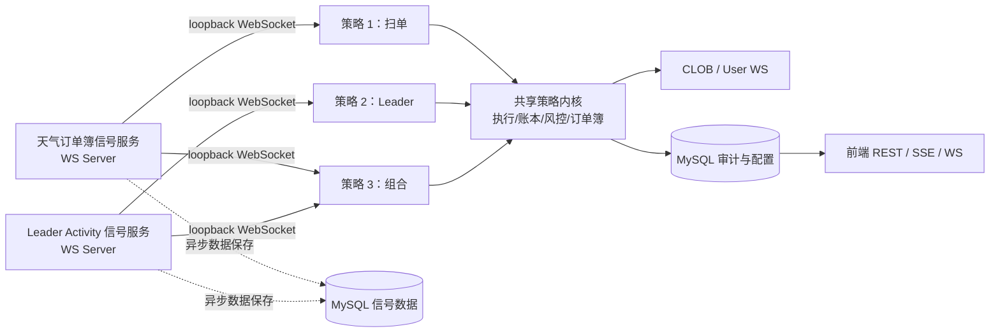
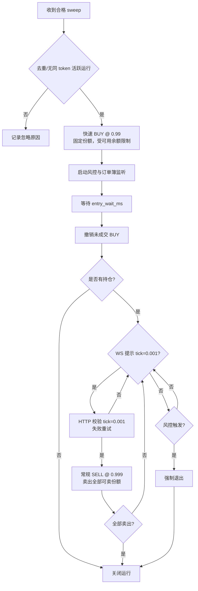
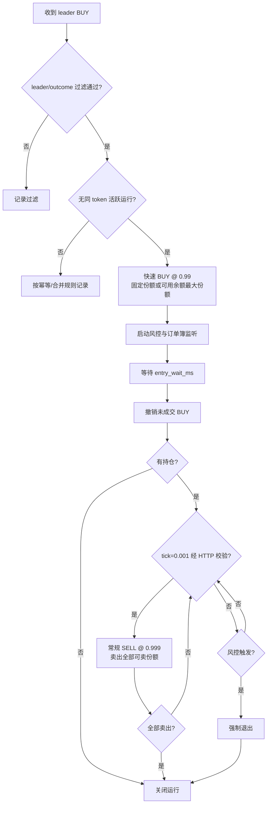
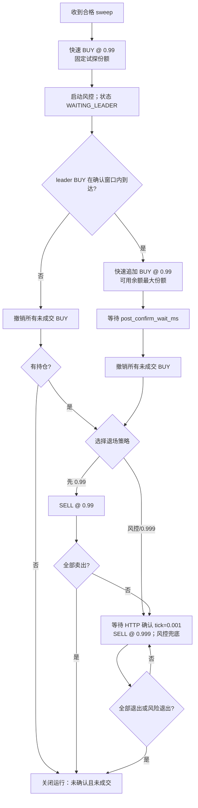

# 策略执行系统需求说明

日期：2026-08-22  
状态：待评审  
范围：在现有 WeatherTaker 的天气信号、Leader 信号和跟单下单能力之上，建设可配置、可审计、低延迟的三类策略执行系统。

## 1. 背景与目标

现有项目已经具备以下基础能力：

- 天气订单簿模块通过 CLOB WebSocket 发现 `weather.sweep` 事件；
- RTDS/Predexon 模块接收 leader 的 activity 信号；
- 跟单模块可以维护订单、持仓、pending buy/sell 和账户可用额度；
- `MarketService` 已维护普通市场订单簿、tick size 和下单所需市场参数；
- 前端已有账户、用户、跟单、Weather、PnL 和性能监控页面。

本次不把三种策略继续堆叠在 `copy_trading.service` 中，而是将“信号获取”和“策略决策”拆开。目标是在保持入场路径低延迟的前提下，实现：

1. 三种策略均以“一次对一个 token 的完整操作”为最小可审计单位。
2. 每次运行都能在前端展示信号、订单、成交、风控、撤单和结束原因。
3. 用户可选择账户和策略，并配置每种策略支持的参数。
4. 余额、挂单占用和持仓以同一内存账本管理，避免并发 BUY 超额下单。
5. 对快速入场，目标是信号被策略收到后至发出下单请求的本地处理开销 P99 小于 10ms；该指标不包含 Polymarket 网络往返和撮合时间。
6. 先落地策略 1，同时保持策略 2、3 可以在不推翻数据模型和通信模型的情况下接入。

## 2. 统一术语与约束

| 术语 | 含义 |
| --- | --- |
| 策略配置（Strategy Config） | 用户、账户、策略类型与可调参数的一组绑定。 |
| 策略运行（Strategy Run） | 对一个 `token_id` 由一个或多个信号驱动的一次完整执行生命周期。 |
| 信号（Signal） | Weather 或 Leader 服务产生的不可变事件，含来源、时间、token、方向及原始 payload。 |
| 快速下单 | 使用预热好的账户客户端、已缓存的固定参数和内存账本，直接签名并发送订单；只用于信号入场。 |
| 常规下单 | 用于撤单、退场、风控、重试等非首个入场操作，可执行额外的校验和查询。 |
| 可用余额 | 链上/交易所真实余额减去未成交 BUY 的保留资金，再减去安全垫 5 USDC。 |

金额和份额必须分开记录。BUY 的资金保留为 `limit_price × requested_shares`（连同费用缓冲），SELL 的保留为可卖份额；不能仅用“固定份额”代替现金账。

每个账户的策略配置在同一时刻最多只能有一个活跃运行占用同一 token 的同一方向仓位。相同信号重复到达时必须命中幂等键而不是重复下单。

## 3. 总体架构

逻辑上采用五个微服务：天气订单簿信号服务、Leader activity 信号服务，以及策略 1/2/3 服务。两个信号服务独立于策略模块；策略服务只是它们的订阅者。所有服务部署在同一台机器，但为真正独立进程；信号通过 loopback WebSocket 实时通知，不在入场关键路径上经过数据库、Redis、消息队列或进程内 `EventBus`。



“共享策略内核”是三个策略服务共用的代码库，不是第六个独立策略微服务。它只提供订单执行、账户资金账本、订单簿订阅、风控和状态机持久化；任何策略判断均保留在策略 1/2/3 服务中。信号数据领域由两个信号服务共同拥有：它们保存来源数据、信号上下文和分析特征；策略内核不得拥有或直接写入这些原始信号数据。

若未来必须拆为五个独立进程，优先使用同机 Unix Domain Socket 或共享内存队列并保持服务同节点部署。跨机器 HTTP、Redis Pub/Sub 或普通 JSON 消息无法承诺 P99 小于 10ms；跨机器时只应把 10ms 作为观测目标，并记录端到端延迟分位数。

### 3.1 统一信号结构

所有信号在进入策略前转换为同一不可变结构。关键路径使用 Python dataclass；若进程间传输，使用 Protobuf 或 MessagePack，避免 JSON 编解码。

```python
@dataclass(frozen=True)
class SignalEnvelope:
    event_id: str                 # 来源事件的全局幂等键
    source: Literal['weather', 'leader']
    event_type: str               # sweep / leader_buy / leader_sell ...
    received_at_ns: int           # monotonic_ns，用于延迟测量
    occurred_at_ms: int           # 来源事件时间
    token_id: str
    outcome: Literal['yes', 'no'] | None
    side: Literal['BUY', 'SELL'] | None
    account_scope: str | None     # leader 地址等选择条件
    payload: Mapping[str, Any]    # 原始信息，仅供审计/非关键路径读取
```

每个信号服务都作为 WebSocket Server：策略服务建立长连接，完成一次内部鉴权后仅接收实时通知。天气信号服务向策略 1 和 3 广播 sweep；Leader Activity 信号服务向策略 2 和 3 广播 activity。策略服务只读取自己关心的字段和本地配置。信号服务在广播后异步保存数据，不得让 MySQL 写入阻塞快速入场。

### 3.2 信号服务的数据职责

信号服务保存的不是仅供策略触发的一条消息，而是一份可检索、可用于离线分析的市场事件数据集：

1. 原始来源 payload 与规范化后的 `SignalEnvelope`；
2. 信号发生时的订单簿上下文（BBO、tick size、深度、延迟）；
3. 对信号计算出的分析特征，例如 sweep 强度、价格变化、leader 的成交规模；
4. 信号的投递结果、策略是否消费、关联到哪些 run；
5. 面向研究和回测的按时间、token、来源、leader、outcome 查询与离线回放能力。

所有“已识别的业务信号”必须异步落库。高频原始订单簿更新不能逐条写入 MySQL；信号服务只保存信号窗口内的抽样/聚合数据，若未来需要逐笔回测则追加对象存储/Parquet 归档，不影响入场路径。数据库仅为分析、审计和离线回放服务，绝不作为策略断线后的实时补发通道。

### 3.3 低延迟通信与数据一致性

| 环节 | 第一阶段实现 | 原则 |
| --- | --- | --- |
| 信号分发 | 信号服务的 loopback WebSocket 广播 | 每个策略服务持有独立长连接；广播不等待策略处理完成。 |
| 去重 | 信号服务的 TTL/LRU `event_id` 集合 | 先去重再广播；`signal_events` 的唯一键在异步持久化时作审计兜底。 |
| 断线语义 | 实时通知，at-most-once | 断线窗口内的信号不补发；策略客户端自动重连、上报健康状态，运行期以幂等键防止重连/重复广播造成重复下单。 |
| 账户资金 | 按账户加锁的内存账本 | 先原子 reserve，成功才发 BUY；失败、撤单和成交均做对账。 |
| token 状态 | `(strategy_config_id, token_id)` 单飞锁 | 防止 sweep 与 leader 并发创建两条运行。 |
| 审计与前端 | 后台批量持久化、SSE/WS | 不阻塞下单；失败可重试并标为 `PERSIST_PENDING`。 |

所有时间戳同时保留来源时间和本地 `monotonic_ns`。性能看板至少展示 `signal_received → order_request_sent`、`order_request_sent → response`、`response → user_ws_fill` 三段延迟。

## 4. 共享执行与风控要求

### 4.1 订单执行器

执行器应提供两类明确接口：

- `place_fast_limit_buy(...)`：策略 1、2、3 的初始/追加 BUY 专用；账户 client、tick size、neg-risk、签名参数预热，调用前已完成账本保留。
- `place_normal_order(...)`：撤单、0.99/0.999 SELL、重试和补偿专用；允许按需 HTTP 校验与更完整的失败处理。

快速 BUY 固定使用 `0.99`，并显式传入已经缓存的 `tick_size=0.01`、`neg_risk` 等参数。只有信号触发的 BUY 可用快速模式；所有退出操作必须走常规模式。

撤单必须只释放订单尚未成交部分。User-channel 的 `PLACEMENT`、`UPDATE`、`CANCELLATION`、`TRADE CONFIRMED` 和轮询结果共同更新同一订单投影，不能重复增减持仓或资金保留。

### 4.2 账户资金账本

每个 follower 账户维护：

```text
available_cash = latest_real_cash - reserved_buy_notional - safety_buffer(5 USDC)
available_shares(token) = confirmed_position - reserved_sell_shares
```

- 启动时和固定周期轮询从 Polymarket 获取真实余额、仓位、开放订单；
- 快速 BUY 之前，在同一账户锁内计算最大可买份额：`floor(available_cash / 0.99)`，再与策略请求份额取较小值；
- 下单请求一经发出即增加 `reserved_buy_notional`；请求失败立即释放；成交时转换为持仓；撤单时仅释放未成交部分；
- 轮询只能校准外部真相，不能粗暴覆盖本地尚未被 user WS 确认的保留状态；
- 每个账本差异都必须记录 reconciliation 事件，方便排查。

### 4.3 风控模块

风控是每个活跃 `Strategy Run` 的子组件，不是全局按 token 的单例。它与运行共享订单簿订阅，但维护独立状态：

```text
avg_entry_price = sum(fill_price × fill_shares) / sum(fill_shares)
position_shares = confirmed_fills - confirmed_sells
```

规则：

1. 运行创建时立即订阅 token 的订单簿并启动风控；若没有任何成交，临时以 BUY 挂单价格作为风险参考价。
2. 每次成交更新平均买入价；未成交 BUY 挂单不计入平均价。
3. 当 `best_bid <= avg_entry_price × stop_loss_ratio`（默认 `0.60`）时，触发强制平仓状态；实际退出价和重试规则由运行的退出策略决定。
4. 当没有活跃 BUY、没有 pending BUY 且 `position_shares == 0` 时才自动关闭风控。
5. 提供管理员强制关闭接口，但必须记录操作者、原因和当时订单/仓位快照；默认不提供给普通用户。
6. WebSocket 通知 tick size 变为 `0.001` 仅作为候选条件。SELL 前必须通过 CLOB HTTP 主动校验 tick size；失败按指数退避重试，超过策略上限后记录失败并继续风控。

## 5. 三个策略

所有策略统一以 `Strategy Run` 状态机表达，推荐主状态：

```text
CREATED → ENTRY_WORKING → ENTRY_TIMEOUT → EXIT_WORKING → CLOSED
                       ↘ RISK_EXITING ─────────────────────┘
                       ↘ FAILED / CANCELLED
```

`WAITING_LEADER` 是策略 3 的子状态；每次状态变化均追加一条审计事件。

### 5.1 策略 1：扫单信号下单

输入：天气服务的合格 `sweep` 信号（默认仅 `outcome=no`）。



策略 1 的“结束”条件为：0.999 SELL 全部成交、风险退出完成、或入口撤单后确认没有持仓。风险触发不允许直接静默关闭运行。

### 5.2 策略 2：Leader 信号下单

输入：指定 leader 的 BUY activity。配置可选过滤 `yes`、`no` 或 `all`；应由 Leader 信号服务在统一信号中提供 `outcome`，不要让策略依赖展示文本解析。



Leader SELL 不作为该策略的入场信号。是否将 leader SELL 映射为提前退出，是未来独立参数和需求，不能在本次默认隐式启用。

### 5.3 策略 3：扫单与 Leader 组合

策略 3 先由 sweep 建立试探仓位；在确认窗口内得到匹配 leader 信号后，再以账户可用余额最大份额追加。没有 leader 确认时，按选定的退场方式处理。



组合策略需要将 sweep 和 leader 信号关联到同一运行。关联条件至少为同一策略配置、同一 token、leader 地址匹配及未过确认窗口；不能仅按 token 全局匹配。

## 6. 可配置参数

所有参数必须有后端 Pydantic 校验、默认值、上下限和参数版本；前端不直接传递未校验的任意 JSON。

| 参数 | 策略 1 | 策略 2 | 策略 3 | 含义 |
| --- | --- | --- | --- | --- |
| `enabled` | 是 | 是 | 是 | 是否接收新信号。 |
| `entry_size_mode` | `fixed` | `fixed` / `max_available` | 试探单 `fixed`，追加 `max_available` | 入口份额模式。 |
| `fixed_entry_shares` | 是 | 是 | 是 | 请求固定份额；余额不足时自动降至可买最大值。 |
| `entry_wait_ms` | 是 | 是 | 是 | 初始 BUY 挂单等待时长。 |
| `sweep_outcome_filter` | 是 | 否 | 是 | 默认 `no`。 |
| `leader_wallet` | 否 | 是 | 是 | 要跟踪的 leader。 |
| `leader_outcome_filter` | 否 | 是 | 是 | `yes` / `no` / `all`。 |
| `leader_confirm_window_ms` | 否 | 否 | 是 | sweep 后等待 leader 的窗口。 |
| `post_confirm_wait_ms` | 否 | 否 | 是 | 追加后等待时长。 |
| `exit_mode` | 固定 `risk_tick_exit` | 固定 `risk_tick_exit` | `risk_tick_exit` / `sell_099_then_risk` | 退出方式。 |
| `exit_wait_ms` | 是 | 是 | 是 | 退出挂单后再次检查/重试间隔。 |
| `stop_loss_ratio` | 是 | 是 | 是 | 默认 `0.60`，范围建议 `(0, 1)`。 |
| `tick_verify_retries` | 是 | 是 | 是 | HTTP tick 校验最大重试次数。 |
| `tick_verify_backoff_ms` | 是 | 是 | 是 | tick 校验初始退避时间。 |
| `safety_buffer_usdc` | 账户级 | 账户级 | 账户级 | 默认 5 USDC，不应由单策略任意降低。 |

`0.99` BUY 和 `0.999` tick-exit SELL 在本期固定，不暴露为普通用户参数，以免破坏策略定义；若未来开放，应使用管理员级版本化策略模板。

## 7. 数据库与审计设计

保留现有 `copy_trading_*` 历史表，不与新策略运行直接混用。新增以下逻辑表，具体字段以迁移为准：

| 表 | 关键字段 | 用途 |
| --- | --- | --- |
| `strategy_configs` | `id, owner_user_id, account_id, strategy_type, enabled, params_json, params_version` | 用户选择账户与策略后的配置。 |
| `signal_events` | `id, source_type, source_event_id, token_id, outcome, side, occurred_at, payload_json` | 信号中心拥有的规范化、可分析的业务信号数据。 |
| `signal_market_contexts` | `signal_id, token_id, best_bid, best_ask, tick_size, book_summary_json` | 信号发生时的盘口上下文，用于后续分析。 |
| `signal_analysis_features` | `signal_id, feature_set, feature_version, features_json, computed_at` | 可版本化的研究特征，支持后续分析与回测复现。 |
| `strategy_config_signal_bindings` | `strategy_config_id, source_type, leader_wallet, outcome_filter, enabled` | 策略对信号中心的订阅条件。 |
| `strategy_runs` | `id, strategy_config_id, token_id, status, state, started_at, ended_at, source_event_id, avg_entry_price, entry_shares, exited_shares, close_reason, version` | 一次 token 操作的聚合根。对活跃状态建立唯一约束或由应用锁保证单飞。 |
| `strategy_run_events` | `id, run_id, sequence_no, event_type, occurred_at, monotonic_ns, payload_json` | 不可变全过程时间线：收到信号、保留余额、发单、撤单、成交、风控和状态变化。 |
| `strategy_orders` | `id, run_id, clob_order_id, purpose, side, limit_price, requested_size, matched_size, status, fast_path, created_at, updated_at` | 一个运行下的全部订单；`purpose` 如 `entry`, `add`, `exit_tick`, `exit_099`, `risk_exit`。 |
| `strategy_account_ledger` | `id, account_id, run_id, token_id, entry_type, cash_delta, shares_delta, reservation_delta, source_order_id, occurred_at` | 资金/份额保留的可追溯账本。 |
| `strategy_run_snapshots` | `run_id, snapshot_at, position_shares, pending_buy, pending_sell, avg_entry_price, best_bid, risk_state` | 可选的诊断快照，避免前端只依赖事件回放。 |

约束要求：

- `signal_events` 对 `(source_type, source_event_id)` 建唯一索引，保证信号数据全局去重；策略运行另以活跃运行键保证不会重复启动；
- `strategy_run_events` 对 `(run_id, sequence_no)` 唯一；
- `strategy_orders.clob_order_id` 唯一且允许入口下单返回前暂存内部 UUID；
- 金额采用 `DECIMAL`，不得用浮点作为数据库计算依据；
- 所有外部 payload 存 JSON 仅用于审计，关键筛选字段拆成列并建立索引；
- 状态变更使用乐观锁 `version` 或事务内行锁，保证退出和成交回报并发时不回退状态。

## 8. 前端需求

新增“策略执行”一级页面，并保留当前“跟单策略”页面，避免在一次改造中破坏既有跟单配置。

### 8.1 策略配置页

- 首先选择用户（root/admin 在其权限范围内）和账户；普通用户只看到自己。
- 选择策略 1、2 或 3 后按策略展示受支持的参数表单，并显示单位、默认值、上下限和参数解释。
- 策略 2、3 必须选择 leader 及 Yes/No/全部过滤；策略 3 还要选择退场模式。
- 保存前展示估算：固定份额所需名义资金、账户安全垫、当前可用余额；估算只是提示，真正下单以服务端账本为准。

### 8.2 运行列表与详情

运行列表以用户、账户、策略、token、状态、开始时间和关闭原因筛选。详情页至少包含：

1. 当前状态和状态机节点；
2. token、市场问题、Yes/No、策略参数快照；
3. 实时持仓、平均成本、未成交 BUY/SELL、可用余额占用；
4. 风控阈值、最新 best bid、tick 校验结果和风险是否已触发；
5. 信号—下单—成交—撤单—退出的时间线及各段延迟；
6. 每笔订单的目的、快速/常规路径、请求量、成交量、价格、状态和错误；
7. 管理员受控操作：停止接收新信号、强制撤单、强制关闭风控（均二次确认与审计）。

前端实时性使用已有 WebSocket 基础或策略专用 WS/SSE。列表可轮询兜底，但实时事件不得依赖每秒全表查询。

## 9. 非功能与验收标准

- 正确性：重复的 sweep、leader activity、user WS 和撤单事件都不能导致重复下单、重复记仓或重复释放资金。
- 延迟：记录并在压测中验证本地 `signal_received → request_sent` P50/P95/P99；目标 P99 < 10ms。
- 可恢复性：重启后从活跃运行、开放订单、账户余额和持仓恢复；需要发现并标记无法自动恢复的异常运行。
- 可观测性：每个运行有 `run_id`，所有日志、订单和指标均携带该值。
- 安全：所有策略配置、运行详情和受控操作须按 `owner_user_id` 校权。管理员可操作范围应与现有角色层级一致。
- 测试：状态机、资金账本、幂等、tick HTTP 校验重试、部分成交、撤单、风险触发和重启恢复均须有自动化测试；真实下单只在明确的受控环境验证。
