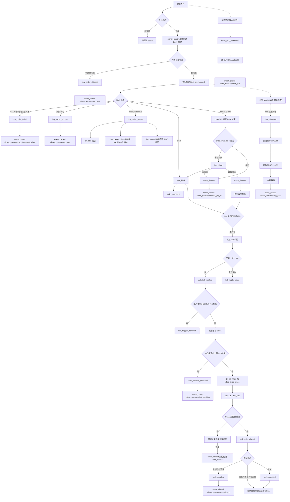
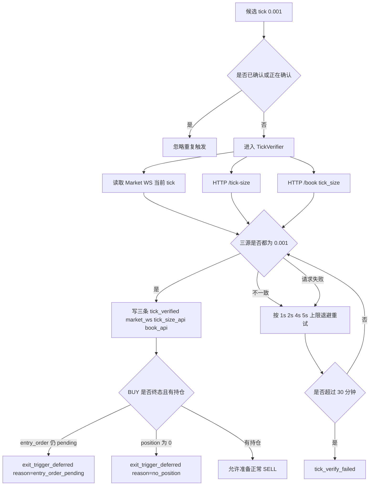
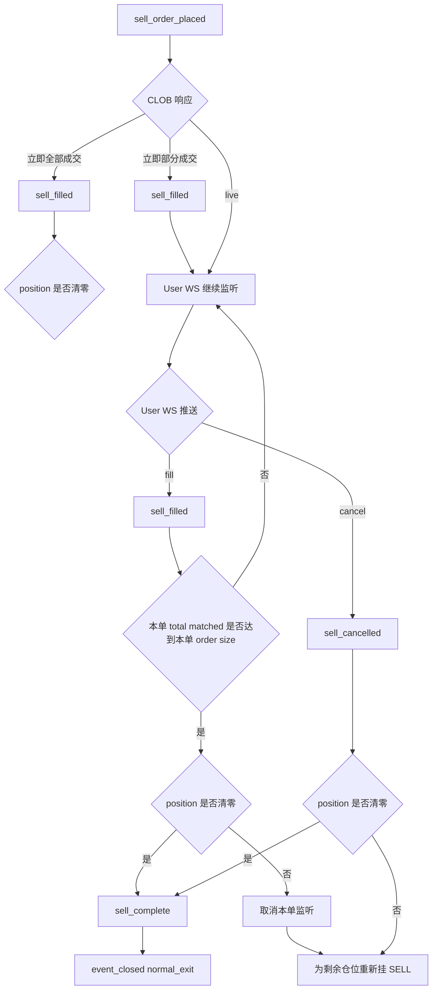
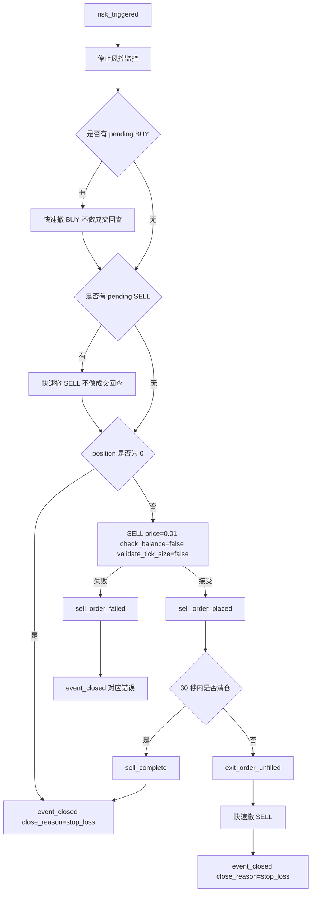
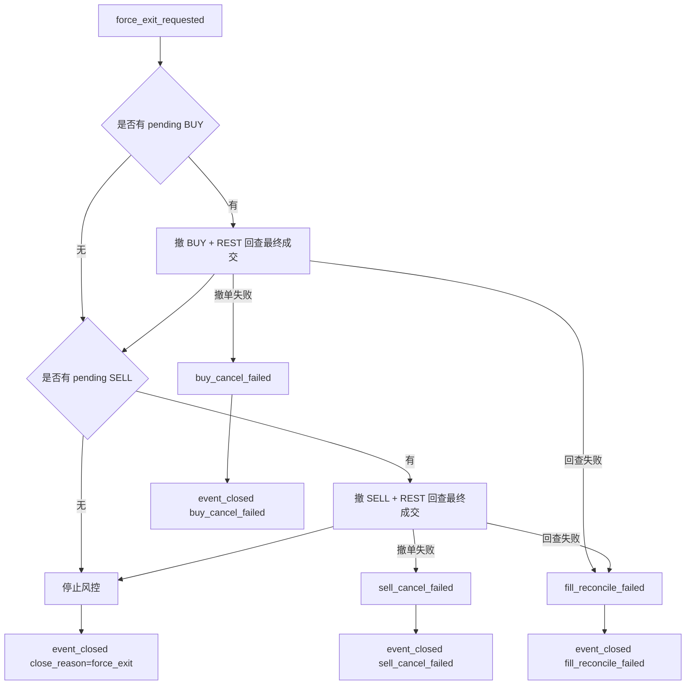

# Weather Sweep 交易全流程

日期：2026-09-04

本文描述当前 `strategy_weather_sweep` 的实际执行流程，覆盖信号过滤、BUY、tick 三源校验、正常 SELL、风控退出、市场结算和强制退出。图中的 step 名称与 `strategy_weather_sweep_events.step` 一致，方便直接对照数据库回放。

主要实现文件：

- `backend/src/strategy_weather_sweep/service.py`
- `backend/src/strategy_weather_sweep/internal/clob_book_bbo.py`
- `backend/src/strategy_weather_sweep/internal/risk_monitor.py`
- `backend/src/strategy_weather_sweep/internal/sell_failure.py`
- `backend/src/framework/strategy_runtime/order_executor.py`
- `backend/src/framework/strategy_runtime/tick_size_service.py`
- `backend/src/framework/strategy_runtime/tick_verifier.py`
- `backend/src/framework/user_ws.py`

## 1. 阶段与关键概念

### 1.1 phase

| phase | 含义 |
|---|---|
| `entry` | 从收到信号开始，到第一次 SELL 下单尝试前。包括 BUY、BUY 成交、BUY 超时撤单、tick 监听和 tick 三源确认。 |
| `exit` | 从第一次 SELL 下单尝试开始，到交易结束。第一次 SELL 失败也属于 `exit`。 |
| `closed` | 只用于 trade 摘要，表示整笔交易结束。`event_closed` 保持关闭前的 `entry` 或 `exit`。 |

当前没有独立的 `monitor` phase。BUY 已发出但第一笔 SELL 尚未尝试时，tick 等待和成交监听都记录在 `entry`。

### 1.2 BBO 的三个概念

| 名称 | 来源 | 用途 |
|---|---|---|
| `pre_bbo` | CLOB HTTP `/book?token_id=...` | 与 BUY 并行发出的订单簿观测，用来观察下单前 BBO。不参与交易决策。 |
| `aft_bbo` | CLOB HTTP `/book?token_id=...` | BUY 被 CLOB 接受后发出的补充订单簿观测。不参与交易决策。 |
| `risk_started` | 风控订阅的 Market WS | 风控启动并记录首个 BBO 状态。它是风控可用性观测，不是 `pre_bbo`。 |

`pre_bbo` 和 `aft_bbo` 作为精简快照写入 `buy_order_placed`；`risk_started` 记录风控启动和首个 BBO 状态。

### 1.3 tick 的候选触发与三源确认

tick 变为 `0.001` 首先只是候选触发。候选可能来自 Market WS 的 `tick_size_change`、风控启动时的立即 HTTP `/tick-size` 检查，或风控的 30 秒 HTTP `/tick-size` 轮询。

真正允许 SELL 前，必须得到三个来源的一致结果：

| 来源 | 说明 |
|---|---|
| `market_ws` | 风控 Market WS 内存中的当前 tick。 |
| `tick_size_api` | CLOB HTTP `/tick-size?token_id=...`。 |
| `book_api` | CLOB HTTP `/book?token_id=...` 返回的 `tick_size`。 |

三源一致且都等于 `0.001` 时，写入三条 `tick_verified` step，各带一个 `source`。不再写单独的 `tick_detect` step。

### 1.4 成交来源

策略用 User WS 维护订单成交：

- CLOB 下单响应中已经包含的成交，先按 `source=clob_response` 记录。
- 后续成交由 User WS 推送，按 User WS 的 source 记录。
- 撤单后通过 REST 查询发现的遗漏成交，按 `source=cancel_reconcile` 或 `source=force_exit_reconcile` 补记。

内存中的 `position_shares` 是 SELL 份额依据；CLOB 服务端仍是余额和可卖份额的最终权威。

## 2. 总体流程图



## 3. 入场 BUY 流程

### 3.1 信号过滤

只有 `signal_type=sweep` 才会进入交易。`market_resolved` 和其他非 `sweep` 信号一样，在策略分发层直接忽略，不创建 event，也不触发任何交易动作。

策略实例还会过滤：

- 同一 `token_id` 已有活跃交易时去重。
- `sweep_outcome_filter`：默认只接受 `NO` outcome，可配置为 `all`。
- `signal_source_filter`：`main`、`next` 或不限制。
- `signal_threshold_filter`：根据 reason 中的温度阈值过滤。
- `direction_filter`：方向过滤。

过滤失败的信号不会创建 event 或 trade。

### 3.2 资金与下单参数

收到合格信号后：

1. 写 `signal_received`。
2. 异步创建 trade 摘要。
3. 读取内存中的可用现金。
4. 计算最大可买份额：`available_cash / 0.99`。
5. 取 `fixed_entry_shares` 与最大可买份额中较小者。

BUY 参数固定为：

| 参数 | 当前值 |
|---|---|
| side | `BUY` |
| price | `0.99` |
| tick_size | `0.01` |
| order type | `GTD`，默认 1800 秒 |
| validate_tick_size | `false` |
| check_balance | `true` |

BUY 不做本地 tick 校验，避免在下单关键路径上额外请求 `/tick-size`。如果计算出的可买份额为 0，写 `buy_order_skipped(status=no_cash)`，然后直接 `event_closed(close_reason=no_cash)`。

### 3.3 并行启动

BUY 请求发出时，同时启动：

1. BUY 下单任务。
2. `pre_bbo` 请求：CLOB `/book`。
3. 风控任务：订阅 Market WS，记录参考 mid，并开始 tick 检测。

BUY 返回后：

1. 如果 BUY 被接受，再发起 `aft_bbo` 请求。
2. 等待 `pre_bbo` 和 `aft_bbo`，将精简后的两个快照写入 `buy_order_placed`。
3. 另有任务等待风控 Market WS 首个 BBO，将风控启动和首个 BBO 状态合并写入 `risk_started`。

### 3.4 BUY 结果分支

| CLOB 结果 | event step | 后续 |
|---|---|---|
| `matched` 且全部成交 | `buy_order_placed` + `risk_started` + `buy_filled` + `entry_complete` | 进入 tick/SELL 判断。 |
| `matched` 且部分成交 | `buy_order_placed` + `risk_started` + `buy_filled` | 记录已成交部分，继续 User WS 监听。 |
| `live` | `buy_order_placed` + `risk_started` | 继续 User WS 监听和 entry 超时计时。 |
| 本地余额不足 | `buy_order_skipped(status=insufficient_balance)` | 停止风控，`event_closed(no_cash)`。 |
| CLOB 拒绝或请求异常 | `buy_order_failed` | 停止风控，`event_closed(buy_placement_failed)`。 |

CLOB `matched` 响应中的成交份额按 side 解析：BUY 使用 `takingAmount`，SELL 使用 `makingAmount`。如果 matched 响应缺少可解析成交份额，会转为失败。

### 3.5 BUY 等待与超时

部分成交或 live 订单会：

1. 通过 User WS `watch_order` 监听后续成交。
2. 启动 `entry_wait_ms` 计时器，默认 1200000 ms。
3. 每笔成交写 `buy_filled`，累计 `position_shares` 和 `entry_cost`。
4. `total_matched >= order_size` 时取消计时器、取消监听，写 `entry_complete`。

超时后：

1. 取消 User WS 监听。
2. 调用撤单并回查最终成交量。
3. 如果撤单失败，写 `buy_cancel_failed`，以 `buy_cancel_failed` 关闭。
4. 如果撤单成功但回查失败，写 `fill_reconcile_unavailable`，当前按非致命处理，继续使用内存仓位。
5. 如果回查发现内存遗漏成交，补写 `buy_filled` 和 `fill_reconciled`。
6. 写 `entry_timeout`。

超时后的分支：

| 最终持仓 | 结果 |
|---|---|
| `position_shares = 0` | `event_closed(close_reason=timeout_no_fill)`。 |
| `position_shares > 0` | 保留持仓；若 tick 已确认则进入正常 SELL，否则继续等待 tick。 |

部分买入后正常卖出并清仓的最终 `close_reason` 是 `normal_exit`，不是单独的 `tick_exit`。

## 4. tick 校验流程



### 4.1 校验规则

- 目标 tick 固定为 `0.001`。
- 三源必须同时存在且完全相等。
- `TickVerifier` 最长持续 30 分钟。
- 内部退避为 1s、2s、4s，之后封顶 5s。
- 校验失败时最终写一条 `tick_verify_failed`，detail 保存最后一次 WS、`/tick-size`、`/book` 的结果和错误。

### 4.2 SELL 前强制刷新

即使此前已经 `tick_verified`，第一次正常 SELL 前仍会再次执行三源刷新。这样可以避免“验证时一致、下单时服务端已切换”的窗口。刷新失败会写 `tick_refresh_failed` 并停止该 event，`close_reason=tick_refresh_failed`。

### 4.3 BUY 与 tick 的先后关系

- tick 先确认、BUY 仍在等待：只记录 `exit_trigger_deferred(reason=entry_order_pending)`，BUY 仍由 `entry_wait_ms` 管理。
- BUY 先全部成交、tick 未确认：继续等待 tick。
- BUY 超时部分成交、tick 已确认：直接进入正常 SELL。
- BUY 超时无成交：即使 tick 确认，也没有仓位，最终以 `timeout_no_fill` 关闭。

## 5. 正常 SELL 流程

### 5.1 进入条件

正常 SELL 只有在以下条件同时满足时才开始：

1. tick 已三源确认。
2. BUY 已到终态：全部成交，或超时撤单后保留部分持仓。
3. `position_shares > 0`。
4. 剩余持仓不小于市场最小 SELL 下单量。

### 5.2 卖出前准备

1. 再次刷新三源 tick。
2. 加载最小下单量：优先 Market WS 内存值，缺失时刷新。
3. 若 `position_shares < min_order_size`，写 `dust_position_detected`，以 `dust_position` 关闭。
4. 计算卖价：`1 - tick_size`。tick 为 `0.001` 时卖价是 `0.999`。
5. 第一次 SELL 前等待 `clob_sync_grace_ms`，默认 2000 ms。等待起点是最近一笔 BUY fill，用来给 CLOB 服务端同步可卖余额留时间。

如果需要等待，写 `exit_trigger_deferred(reason=clob_sync_grace)`。

### 5.3 SELL 参数

| 参数 | 当前值 |
|---|---|
| side | `SELL` |
| price | `1 - tick_size`，通常 `0.999` |
| tick_size | 最新三源共识 tick |
| order type | `GTC` |
| check_balance | `false` |
| validate_tick_size | `true` |

`check_balance=false` 表示策略不依赖本地余额判断可卖份额，但 CLOB 服务端仍会做最终校验。

### 5.4 被接受后的执行



当前正常 SELL 被接受后没有固定挂单超时，也不会因为超时撤单后重挂相同价格订单。订单会保持 live，直到本单全部成交、User WS 收到撤单，或风控、市场结算、强制退出介入。

每个被接受的 SELL 订单记录自己的 `order_size`。判断“本单完成”使用 `event.total_matched >= 本单 order_size`；判断“交易完成”使用 `position_shares <= 0`。

因此，余额滞后导致先只卖出部分仓位时，例如总持仓 20、服务端可卖 10.9：

1. 第一笔 SELL 只挂 10.9。
2. 该单全部成交后，本单结束，但总仓位仍剩 9.1。
3. 循环继续，为 9.1 重新挂 SELL。
4. 所有仓位清零后才写 `sell_complete` 和 `normal_exit`。

### 5.5 SELL 失败与重试

SELL 未被接受时先写 `sell_order_failed`，再按错误签名处理。

| 错误 | 当前策略 |
|---|---|
| `insufficient_balance` | 解析服务端错误里的可卖份额。若可卖份额不小于最小下单量且小于本次想卖数量，立即按较小数量重试；否则等待 120s、300s、600s，之后继续按 600s 等待。余额滞后不进入三次同错熔断。 |
| `invalid_tick_size` | 等待 120s、300s、600s，每次后刷新三源 tick 并重试。三次后仍失败则停止；刷新失败也停止。 |
| 其他错误 | 指数退避 2s、4s、8s，直到 60s 封顶；同一错误连续 3 次触发单 event 熔断。 |

相关 step：

- `balance_settlement_retry`
- `sell_retry_started`
- `tick_refreshed`
- `tick_refresh_failed`
- `sell_circuit_breaker_triggered`

另有策略级跨 event 熔断：同一错误签名在 300 秒窗口内达到 3 个 event，会暂停策略并禁用配置，写 `strategy_paused`。

## 6. 风控退出

风控由 Market WS BBO 驱动：

```text
current_mid <= signal_mid * stop_loss_ratio
```

默认 `stop_loss_ratio` 为 0.60。触发后写 `risk_triggered`，进入快速退出路径。



风控路径优先速度：

- 撤单使用快速路径，不做撤单后 REST 成交回查。
- 若有持仓，直接提交 `SELL @ 0.01`。
- `check_balance=false`。
- `validate_tick_size=false`。
- 传入的 tick size 使用策略内存中的当前值，通常为 `0.01`；如果 tick 已确认，也可能是 `0.001`。
- 卖单最多等待 30 秒；未清仓则撤单并关闭 event。

如果快速撤单失败，会记录 `buy_cancel_failed` 或 `sell_cancel_failed`。即使地板价 SELL 清仓成功，只要存在撤单失败，最终也会按撤单错误关闭，避免掩盖线上可能仍 LIVE 的订单。

## 7. market_resolved 信号

当前策略收到 `signal_type=market_resolved` 后直接忽略：

- 不匹配活跃交易。
- 不写 `market_settled` step。
- 不撤销 BUY 或 SELL。
- 不发地板价 SELL。
- 不关闭 event。

该信号仍可能由信号服务产生、存储和通过 WS 广播，但策略侧不消费它。

## 8. 强制退出

强制退出由配置禁用、配置变更、容器停止或人工控制触发。



当前 `force_exit` 的职责是停止策略管理中的订单，不主动新发 SELL：

- 撤销 BUY 和 SELL。
- 尽量通过 REST 回查并校准成交。
- 关闭 event 和 trade。

如果回查发现内存遗漏成交，会补写 `fill_reconciled` 和对应 `buy_filled` / `sell_filled`。

## 9. 终态与 close_reason

| close_reason | 触发场景 | 常见前置 step |
|---|---|---|
| `normal_exit` | 有持仓并最终全部卖出。 | `sell_order_placed`、`sell_filled`、`sell_complete` |
| `no_cash` | 可用资金不足，未真正发起 BUY。 | `buy_order_skipped` |
| `timeout_no_fill` | BUY 超时且没有任何成交。 | `entry_timeout` |
| `dust_position` | 剩余持仓小于最小 SELL 下单量。 | `dust_position_detected` |
| `buy_placement_failed` | BUY 请求失败或被 CLOB 拒绝。 | `buy_order_failed` |
| `sell_placement_failed` | SELL 请求没有被接受且重试停止。 | `sell_order_failed`、`sell_circuit_breaker_triggered` |
| `exit_order_unfilled` | 风控卖单 30 秒未清仓。 | `exit_order_unfilled` |
| `sell_fill_parse_error` | CLOB matched 响应无法解析成交份额。 | `sell_order_failed` |
| `fill_reconcile_failed` | 撤单成功但最终成交回查失败。 | `fill_reconcile_failed` |
| `buy_cancel_failed` | BUY 撤单失败。 | `buy_cancel_failed` |
| `sell_cancel_failed` | SELL 撤单失败。 | `sell_cancel_failed` |
| `tick_refresh_failed` | SELL 前三源 tick 刷新失败或不一致。 | `tick_refresh_failed` |
| `stop_loss` | 风控止损退出。 | `risk_triggered` |
| `force_exit` | 配置或人工强制关闭。 | `force_exit_requested` |
`event_closed` 是唯一终态 step。写入后 event 不应再追加过程记录。trade 摘要同步更新 `phase=closed`、`close_reason`、PnL、duration 和 `closed_at`。

## 10. 当前流程的边界

1. **BUY 与风控并行**：BUY 请求和风控订阅同时启动。风控可能在 BUY 响应尚未返回时触发，这是速度优先设计；该并发窗口依赖后续订单结果处理和撤单路径兜底。
2. **正常 SELL 无固定超时**：被接受后不会因为时间重挂相同订单，避免丢失队列位置；退出依赖成交、撤单推送、风控或强制退出。
3. **风控优先速度**：风控撤单不回查成交；地板价 SELL 只等 30 秒。它可能以 `stop_loss` 关闭且仍有持仓。
4. **强制退出不新发卖单**：它只撤已有订单并回查。若有剩余持仓，会以 `force_exit` 关闭，仓位需要后续人工或恢复机制处理。
5. **三源确认成功写三条**：一次 tick 变化不会产生额外 `tick_detect` step，只产生 `market_ws`、`tick_size_api`、`book_api` 三条 `tick_verified`。
